# 📚 TineaBook

> *Sua bússola literária: encontre, acompanhe e compartilhe suas leituras em um só lugar.*

    

---

## 📑 Sumário

1. [Visão Geral](#visão-geral)
2. [Funcionalidades](#✨-funcionalidades)
3. [Arquitetura](#🧱-arquitetura)
4. [Estrutura de Pastas](#🏗-estrutura-de-pastas)
5. [Pré‑requisitos](#⚙️-pré‑requisitos)
6. [Primeiros Passos](#🖥️-começando)
7. [Implantação](#🚀-implantação)
8. [Roadmap](#🗺️-roadmap)
9. [Contribuição](#🤝-contribuição)
10. [Licença](#📄-licença)
11. [Créditos e Equipe](#👩‍💼-contato--equipe)

---

## Visão Geral

**TineaBook** é uma plataforma *full‑stack* para descoberta, acompanhamento e compartilhamento de leituras. O ecossistema é composto por:

| Camada                 | Tecnologia             | Descrição                                                                             |
| ---------------------- | ---------------------- | ------------------------------------------------------------------------------------- |
| **Mobile**             | React Native (Expo)    | Aplicativo para navegação de catálogo, marcações de leitura e interação social.       |
| **API**                | ASP.NET Core 8 Web API | Serviço RESTful que centraliza catálogo, usuários, avaliações e progresso de leitura. |
| **Site institucional** | React (Vite)           | Landing page com informações da marca e formulário de contato.                        |
| **BD**                 | PostgreSQL             | Persistência de dados; script e MER disponíveis em `/bd`.                             |

> **Status do projeto:** em desenvolvimento — primeiro MVP previsto para o 📅 *Q4 / 2025*.

---

## ✨ Funcionalidades

- 🔍 **Pesquisa inteligente** de livros por título, autor ou ISBN, consumindo a *Google Books API* (ou outra pública de metadados).
- 📖 **Estante pessoal**: adicione livros a “Lendo”, “Lidos” ou “Quero Ler”.
- ⏲ **Progresso de leitura** com registro de páginas e estimativa de tempo restante.
- 🏷 **Marcadores & anotações**: grife trechos e salve comentários privados.
- ⭐ **Avaliações e resenhas** públicas com sistema de likes e respostas.
- 📰 **Feed social**: siga amigos e descubra leituras recomendadas.
- 🛎 **Notificações push** (Expo Notifications) para lembretes de leitura e novas interações.
- 💎 **Versão Premium** (futuro): estatísticas avançadas, temas e experiência sem anúncios.

---

## 🧱 Arquitetura

```mermaid
graph TD
    A[Expo App] -- REST --> B[ASP.NET Core API]
    B -- SQL --> C[(PostgreSQL)]
    A -- GraphQL (futuro) --> B
    D[Site React] -- REST --> B
    B -- gRPC (microserviços futuro) --> E[Serviços Auxiliares]
```



A arquitetura é modular para permitir escala futura (microserviços) e reuso de componentes.

---

## 🏗 Estrutura de Pastas

```text
.
├── api/                     # ASP.NET Core 8 Web API
│   ├── API-Tineabook/       # Código-fonte principal da API
│   └── Dockerfile           # Imagem de produção
├── tineabook-app/           # App mobile Expo (versão atual)
├── site-institucional/      # Landing page React (Vite)
├── bd/                      # Script SQL & esquema ER
├── docs/                    # Wireframes, fluxos e specs
├── .github/                 # Workflows CI/CD
├── .expo/                   # Configurações geradas pelo Expo
├── .vscode/                 # Settings de editor
├── package.json             # Dependências globais (root)
└── README.md                # Este arquivo
```

> Antigo protótipo (`app-tineabook/`) permanece para referência histórica e será removido até o *beta*.

---

## ⚙️ Pré‑requisitos

| Ferramenta     | Versão mínima | Observação               |
| -------------- | ------------- | ------------------------ |
| **Git**        | 2.38          | Controle de versão       |
| **Node.js**    | 18 LTS        | Recomendado usar **nvm** |
| **Expo CLI**   | 7+            | `npm i -g expo-cli`      |
| **.NET SDK**   | 8+            | Necessário para `api/`   |
| **PostgreSQL** | 15+           | Local ou serviço cloud   |
| **Yarn / npm** | 9+            | Gerenciador de pacotes   |

---

## 🖥️ Começando

```bash
# 0. Clone o projeto
git clone https://github.com/<usuario>/tineabook.git
cd tineabook
```

### 1️⃣ Configurar variáveis de ambiente

Crie um arquivo `.env` em `api/API-Tineabook/`:

```dotenv
ASPNETCORE_ENVIRONMENT=Development
POSTGRES_CONNECTION=Host=localhost;Database=tineabook;Username=postgres;Password=postgres
JWT_SECRET=troque-para-uma-chave-forte
```

### 2️⃣ Mobile (Expo)

```bash
cd tineabook-app
npm install          # ou yarn
npx expo start
```

### 3️⃣ API (.NET 8)

```bash
cd api/API-Tineabook
dotnet restore
dotnet ef database update   # cria/atualiza o schema (PostgreSQL)
dotnet watch run            # Hot reload + Swagger em http://localhost:5173/swagger
```

### 4️⃣ Site institucional (opcional)

```bash
cd site-institucional
npm install
npm run dev                 # Vite dev server em http://localhost:5174
```

---

## 🧩 Dependências Principais

### Mobile

- `expo`, `expo-router`
- `react-native*`, `react-native-safe-area-context`
- `@react-navigation/*`, `react-native-gesture-handler`
- `axios`, `swr`
- `expo-constants`, `expo-notifications`

### API

- `Microsoft.AspNetCore.OpenApi`, `Swashbuckle.AspNetCore`
- `Npgsql` & `Npgsql.EntityFrameworkCore.PostgreSQL`
- `FluentValidation`
- `Serilog`

---

## 🚀 Implantação

| Ambiente                 | Estratégia                                             |        |
| ------------------------ | ------------------------------------------------------ | ------ |
| **Expo EAS**             | Build cloud do app (\`eas build --platform android     | ios\`) |
| **Render.com / Railway** | Deploy contínuo da API com Dockerfile + GitHub Actions |        |
| **Vercel / Netlify**     | Hospedar site‑institucional estático                   |        |

Scripts de CI/CD encontram‑se em `.github/workflows/`.

---

## 🗺️ Roadmap

-

Veja as *issues* com a label **roadmap** para detalhes.

---

## 🤝 Contribuição

1. **Fork** do projeto.
2. Crie uma *branch* (`git checkout -b feat/minha-feature`).
3. Faça *commit* (`git commit -m 'feat: minha feature'`).
4. *Push* (`git push origin feat/minha-feature`).
5. Abra um *pull request*.

Leia `CONTRIBUTING.md` (em breve) para convenções, políticas de branch e *commit lint*.

### Execução de testes

```bash
# Mobile
cd tineabook-app
npm test          # Jest

# API
cd api/API-Tineabook
dotnet test
```

---

## 📄 Licença

Distribuído sob a licença **MIT** — consulte [LICENSE](LICENSE) para mais detalhes.

---

## 👩‍💼 Instagram Tineabook 

https://www.instagram.com/tineabook?igsh=MWg5cndzbDFvaXJkOQ==

## 🙏 Agradecimentos

- [Google Books API](https://developers.google.com/books) pelo acesso ao catálogo público.
- Comunidade **Expo** e **ASP.NET** pelos recursos e suporte.
- Todos os *beta testers* que ajudaram a moldar o TineaBook.

